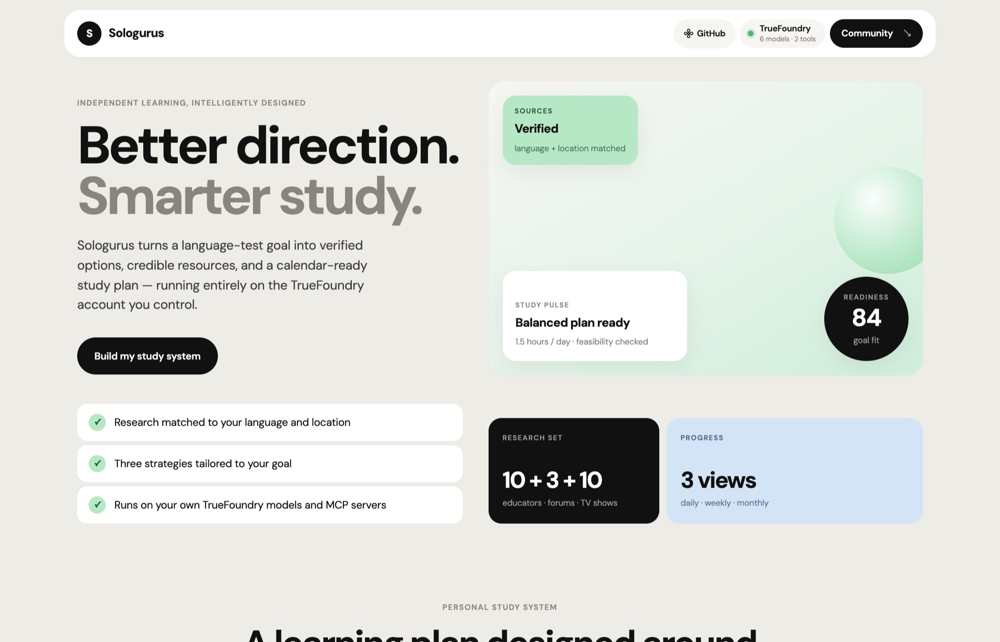
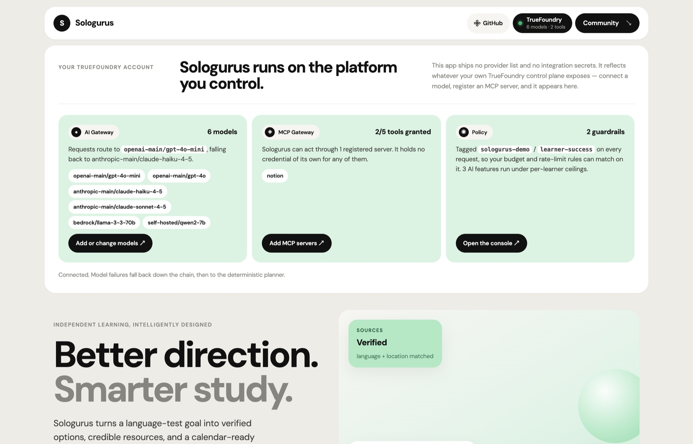
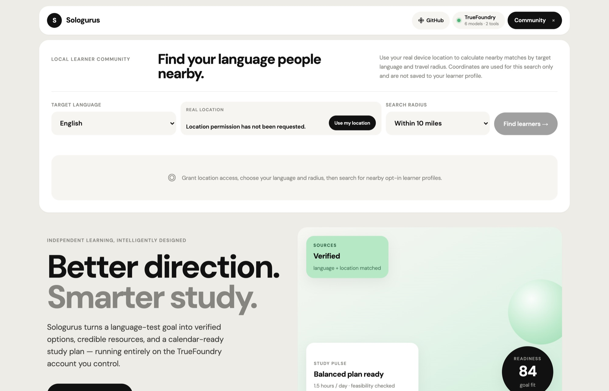
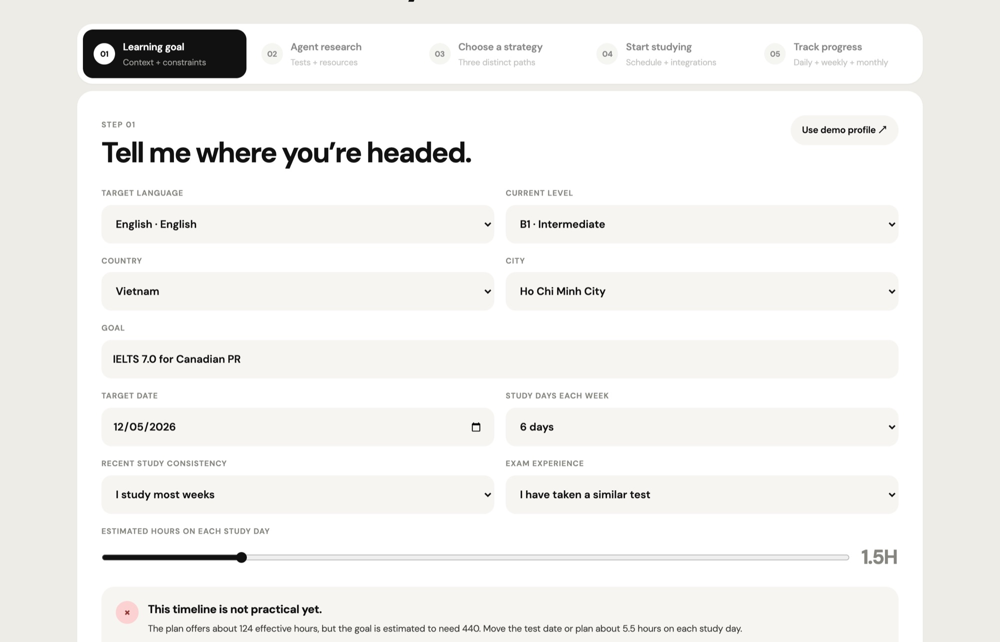
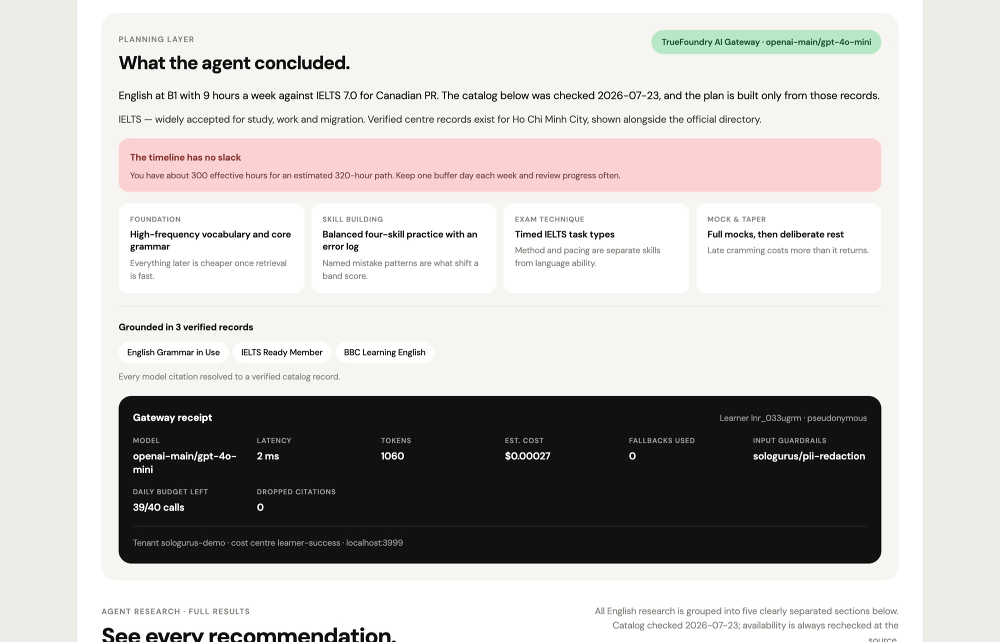
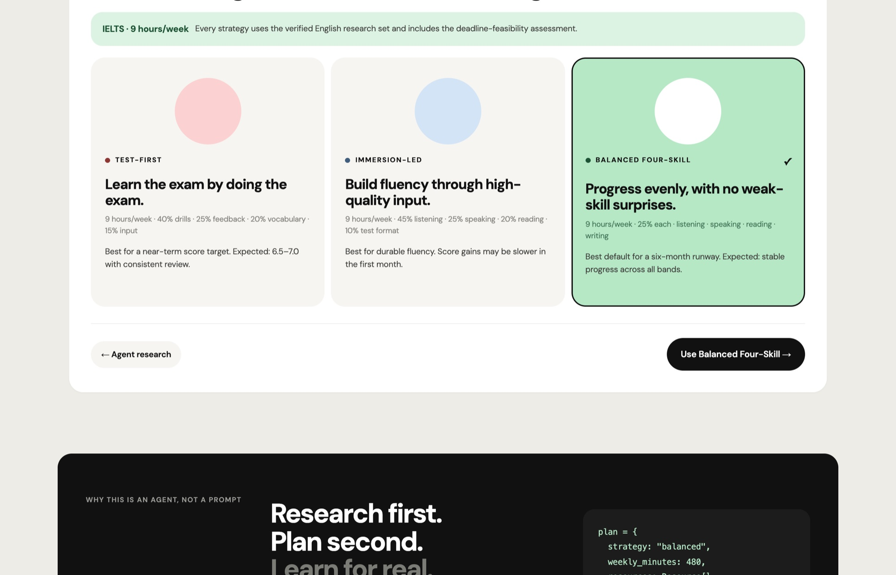
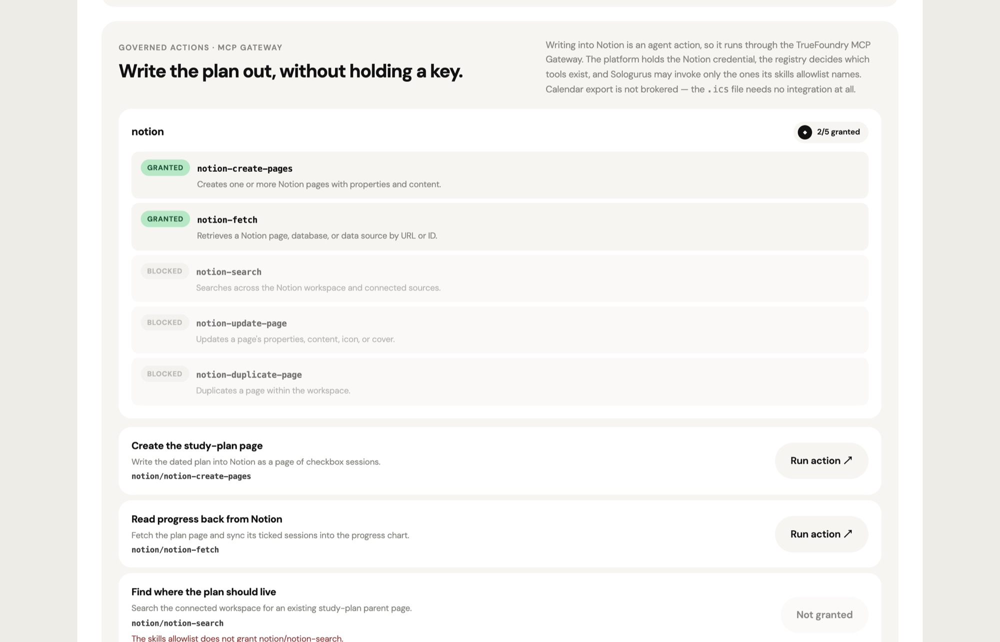
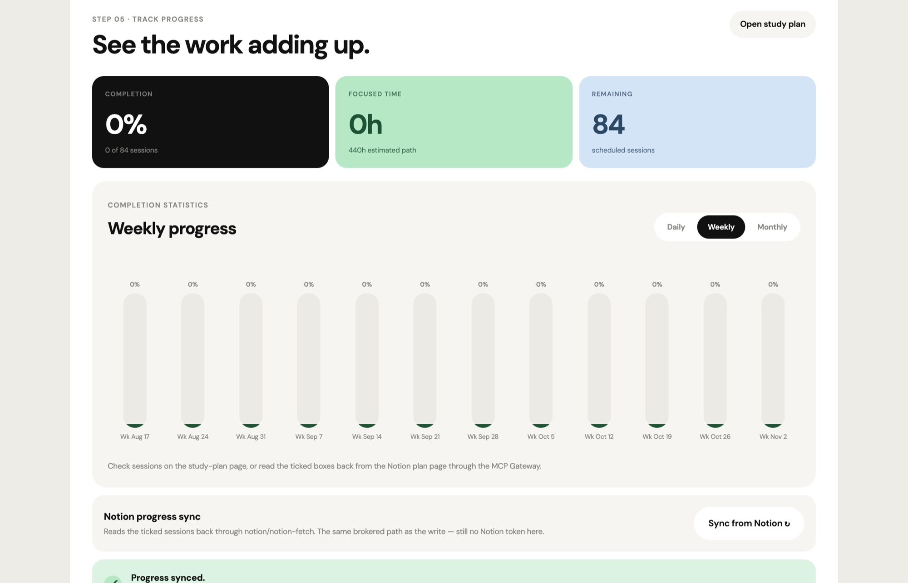

<div align="center">


# Sologurus

**A self-directed language-learning agent that turns a goal into evidence, strategy, and scheduled action — running entirely on the TrueFoundry account you control.**

[Live demo](https://sologurus-study-agent.lu-liu398220.chatgpt.site) · [Demo script](DEMO_SCRIPT.md) · [Submission](SUBMISSION.md)

[](https://github.com/Dec444/sologurus-demo/actions/workflows/ci.yml)
[](https://nodejs.org/)
[](LICENSE)

</div>

## Why Sologurus

Language learners rarely lack motivation; they lack a system. Choosing an exam, checking test centers, evaluating teachers, finding materials for every skill, and fitting it all into a real week can become a second job.

Sologurus turns a learner's language, level, location, goal, deadline, and realistic study rhythm into a transparent study system. It shows the evidence behind its recommendations, estimates whether the deadline is practical, offers three genuinely different strategies, and sends a dated plan to tools learners already use.

> **Hackathon scope:** the public demo ships a dated, source-linked catalog for every selectable language. The browser reloads that catalog through `/api/resources` whenever language or location changes; official exam directories remain the source of truth for current dates and availability.
> Model reasoning runs through the TrueFoundry AI Gateway and is grounded in that catalog. Without gateway credentials the app still runs end to end on its deterministic planner, and says so on every AI panel.

## Try the demo

Open the [live Sologurus demo](https://sologurus-study-agent.lu-liu398220.chatgpt.site), then:

1. Open the **TrueFoundry** chip to see the models and MCP tools your account exposes, with links into your console to add more.
2. In Community, select **Use my location**, allow browser location access, and search for nearby English learners within 5, 10, or 25 miles.
3. Open the target-language menu to see all 16 choices.
4. Select **Use demo profile**.
5. Run **Build my study system** and watch the dedicated agent-research page populate.
6. Read **What the agent concluded** and its **gateway receipt** — model, latency, tokens, estimated cost, fallbacks used, guardrails, and remaining daily budget.
7. Review the five research sections, including three textbook recommendations, then continue to the separate strategy page.
8. Compare the three study strategies and continue to the **Start studying** page.
9. Open **Governed actions** to see every tool the registered Notion MCP server exposes, granted and blocked side by side, then run the study-plan action through the gateway.
10. Paste a writing sample into the **writing feedback loop** and have it marked against the target exam rubric.
10. Review the dated study table, mark a few sessions complete, and open **Track progress** to switch among daily, weekly, and monthly statistics.
11. Tick a box on the Notion page itself, then use **Sync from Notion** on the progress page to read it back through `notion-fetch`.
12. Download the universal `.ics` calendar, which works with no account at all.

The seeded learner is an intermediate English speaker in Ho Chi Minh City pursuing IELTS 7.0 for Canadian permanent residence, studying 1.5 hours per day across six days each week.

## Product tour

### 1. Home

Start with the workflow, the platform connection status, and a clear route into the study-system builder.



### 2. Your TrueFoundry connection

One chip opens the connection panel: the models your account can reach, the MCP tools Sologurus was granted, and the guardrail and cost policy — each linking into your own console to add more. The app ships none of this itself.



### 3. Community

Choose a target language and radius, then use real browser location to discover nearby opt-in learner profiles.



### 4. Learning goals

Define the language, level, location, deadline, availability, and experience the agent uses to assess feasibility.



### 5. Agent research

Read what the planning layer concluded, with a gateway receipt — model, latency, tokens, cost, guardrails, budget — over the verified evidence library.



### 6. Choose a strategy

Compare three distinct learning approaches against the same honest weekly time budget.



### 7. Start studying

Turn the chosen strategy into dated sessions, and write the plan to Notion through the MCP Gateway — granted tools next to blocked ones, no credential held by the app.



### 8. Track progress

Review completion, focused time, remaining sessions, and read ticked boxes back from Notion through the same broker.



## What it does

| Capability | Demo result |
|---|---|
| Learner profile | 16 target languages, dependent country/city menus, level, goal, deadline, daily hours, study days, consistency, and exam experience |
| Connection panel | One TrueFoundry chip reporting live model count, granted MCP tools, and policy — each linking into your own console to add more |
| Community finder | Real browser location, city/region resolution, and coordinate-based 5–100 mile matching without saving coordinates to a learner profile or showing exact addresses |
| Feasibility check | Estimates required versus effective hours and clearly flags a tight or impractical deadline |
| Test explorer | Language-specific recognized tests, an explained recommendation, verified local records where available, and an official center finder everywhere |
| Guidance | Exactly 10 language-specific YouTube educators and 3 study forums |
| Immersion | Exactly 10 native-language TV shows with origin, genre, and suggested learner level |
| Mock exams | Exactly 3 language-specific exam simulators or official sample-test platforms |
| Resource library | Listening, speaking, reading, and writing materials that reload with the target language |
| Textbooks | Exactly 3 established, language-specific coursebooks with publisher attribution |
| Strategy builder | Test-First, Immersion-Led, and Balanced Four-Skill plans |
| Dated study plan | 14–84 sessions with dates, phases, focus, textbook, practice source, duration, and completion state |
| Progress | Switchable daily, weekly, and monthly completion charts |
| Governed AI | Every model call routed through the TrueFoundry AI Gateway with a model fallback chain, guardrails, per-learner budgets, and a visible cost/latency receipt |
| Writing feedback | A learner writing sample marked against the target exam rubric, with identifiers stripped server-side before the request leaves |
| Governed actions | Notion reads and writes brokered through the TrueFoundry MCP Gateway against a closed-by-default skills allowlist. No `NOTION_TOKEN` exists in this codebase |
| Notion | The dated plan written as a page of checkbox sessions, and ticked boxes read back into the progress chart — both through the MCP Gateway |
| Calendar | 12 study sessions, 3 recurring reminders, and a universal `.ics` export |

## How it works

Sologurus is designed as a planner over structured operations, not a chatbot that free-writes a curriculum.

```text
Learner profile
      │
      ▼
Planner / orchestrator
      ├── search_tests()      → test choices, sources, and local centers
      ├── rank_guidance()     → ranked educators with rationale
      ├── curate_resources()  → skills + TV immersion + three textbooks
      ├── match_mock_exams()  → three exam-specific practice environments
      └── synthesize_plan()   → feasibility + 3 strategies + dated sessions
                                      │
                            TrueFoundry AI Gateway
                    (model chain · guardrails · budget · receipt)
                                      │
                                      ▼
                    Notion subpage · progress chart · Calendar
```

Each stage returns predictable records. The planning layer composes the selected language's exam and resources into concrete, time-boxed sessions and verifies that the total does not exceed the learner's availability.

### Bring your own platform

Sologurus ships no provider list, no model names, and no integration secrets. It connects to *your* TrueFoundry control plane and reflects whatever you have put there.

One chip in the header opens the connection panel, which reports three things and links straight into your console for each:

| Card | Shows | Links to |
|---|---|---|
| **AI Gateway** | Every model your account can reach, discovered live from the gateway's OpenAI-compatible `/models` route, and the fallback chain in use | `/llm-gateway` — add or change models |
| **MCP Gateway** | Registered servers and how many of their tools Sologurus was granted | `/llm-gateway/mcp-servers` — register a server, grant tools |
| **Policy** | Guardrail groups, the `tenant` / `cost_center` tags every request carries, and the per-learner ceilings | your console root |

Connect a model and it appears. Register an MCP server and its tools appear, granted or blocked. Nothing about the product is wired to a particular vendor: the header has no Notion login and no Google login, because those relationships belong in your control plane, not in this app's environment.

The console URL is derived from `TFY_GATEWAY_BASE_URL`'s origin — a dedicated control plane serves the gateway at `https://<your-plane>/api/llm`, so the console is `https://<your-plane>`. Override with `TFY_CONSOLE_URL` if they differ. Nothing is derived from the shared SaaS gateway host, since that is not a console; the panel says so rather than offering a dead link.

### Governed on the TrueFoundry AI Gateway

Sologurus is an education product, so the interesting question is not "does it call a model" but "can an institution run it". Every model call goes through [`lib/truefoundry.mjs`](lib/truefoundry.mjs), which is the only place in the codebase that can reach an LLM. The regression suite asserts that no route bypasses it.

| Gateway capability | How Sologurus uses it |
|---|---|
| One OpenAI-compatible endpoint | `POST {gateway}/api/inference/openai/chat/completions` for every feature, so swapping models is configuration, not code |
| Model fallback chain | `TFY_MODEL_CHAIN` is walked in order; a 429, a 5xx, or a timeout moves to the next model, and the receipt reports how many fallbacks were used |
| Guardrails | `x-tfy-guardrails` applies the configured PII-redaction and content-safety groups to input and output |
| Request metadata | `x-tfy-metadata` tags every call with tenant, cost centre, environment, feature, and pseudonymous learner id — the same keys a gateway `when` block matches on for rate limits and budgets |
| Prompt logging control | `x-tfy-logging-config` disables prompt logging for any feature that carries learner prose |
| Timeouts | `x-tfy-request-timeout` bounds each call, so an exam-season traffic spike degrades instead of hanging |
| Cost observability | Token counts, latency, fallback count, and a spend estimate are shown to the learner in a "gateway receipt" on the research page |

Two AI features are declared in [`lib/governance.mjs`](lib/governance.mjs), each with its own daily call and token ceiling:

- **Research synthesis** (`POST /api/agent`) — explains why the curated evidence fits this learner, and what puts the deadline at risk. Grounded: the model receives a digest of names, levels, and purposes, never URLs or addresses, and any citation it returns that is not in the verified catalog is dropped rather than displayed.
- **Writing feedback** (`POST /api/feedback`) — marks a learner writing sample against the target exam rubric.

`GET /api/gateway` publishes the whole policy — model chain, guardrails, ceilings, and privacy stance — without exposing a credential.

**Privacy posture.** Requests carry a pseudonymous learner id derived from study goals, never a name, an email, or coordinates. Learner prose is redacted server-side *before* it reaches the gateway, independently of the gateway's own PII guardrail, so a misconfigured guardrail cannot become a data-exposure bug. Registration links and test-centre addresses are always rendered from the curated catalog, never from model output.

**Degradation.** With no `TFY_API_KEY`, the app still runs end to end: the deterministic planner answers, every AI panel is labelled offline, and the writing lab reports a structural check that explicitly refuses to invent a band score. The same path covers a spent budget and an unreachable gateway.

### Brokering actions through the MCP Gateway

Writing a plan into Notion is not inference — it is an *agent action*, and in a school that is the part with real blast radius. So that write goes through the TrueFoundry MCP Gateway rather than through a credential this application holds.

```text
Sologurus  ──POST──▶  {gateway}/mcp/{integrationId}/server   ──▶  Notion MCP server
                      streamable HTTP · Bearer TFY_API_KEY
                      registry decides which tools exist
                      platform holds the Notion credential
```

Notion is the registered server for this workspace. **Calendar export is deliberately not brokered**, because it needs no integration at all: the `.ics` file is generated in the browser and imports into Google, Apple, or Outlook with no account, no OAuth, and nothing to govern.

[`lib/mcp-gateway.mjs`](lib/mcp-gateway.mjs) is a dependency-free MCP client over the gateway's streamable-HTTP proxy: `initialize` → `notifications/initialized` → `tools/list` / `tools/call`, echoing the `Mcp-Session-Id` the gateway returns and decoding either a JSON or a server-sent-event reply.

Three properties matter more than the transport:

- **Sologurus holds no Notion credential — at all.** There is no `NOTION_TOKEN`, and a regression test walks `app/`, `lib/`, and `worker/` asserting that nothing calls `api.notion.com` and nothing reads a Notion secret. Both directions go through the gateway: the write *and* the progress read. A leak of this application's environment cannot reach a learner's workspace.
- **The skills allowlist is closed by default.** `TFY_MCP_ALLOWED_TOOLS` names `server/tool` pairs against the real Notion MCP tool names. A tool the registry exposes but this product was never granted is refused *before the request is built*, and again in the route — the discovery panel shows blocked tools next to granted ones, so an administrator can see exactly what the app can reach.
- **The browser names an intent, never a tool.** [`lib/mcp-actions.mjs`](lib/mcp-actions.mjs) is a closed list of declared actions, each binding one product intent to one tool with the payload built server-side. A crafted request cannot reach an arbitrary tool with an arbitrary body even before the allowlist is consulted.
- **Actions are metered like inference.** `governed-actions` is declared in the same policy as the model features, with its own daily per-learner ceiling. Every dispatch counts, including refused ones.

| Declared action | Notion MCP tool | What it does |
|---|---|---|
| `notion-study-plan` | `notion-create-pages` | Writes the dated plan as a page of checkbox sessions |
| `notion-plan-progress` | `notion-fetch` | Reads the ticked sessions back into the progress chart |
| `notion-find-workspace` | `notion-search` | Finds an existing parent page for the plan |

Each session line carries a `[Sologurus day N]` marker, so a learner can tick boxes in Notion, reorder them, or edit the text around them, and the round trip still resolves to the right sessions.

`GET /api/mcp` discovers and publishes the registry state — including *why* each declared action is or is not runnable; `POST /api/mcp` runs one and returns a typed result (a page reference, a list of completed days, or text) rather than raw tool prose.

**There is no fallback, and that is the point.** With no MCP server registered, Sologurus cannot touch Notion in either direction — it has no credential to fall back to. The interface says exactly that. The `.ics` export still works, because it never needed an account.

### Demo mode and live integrations

- **Reactive verified research:** `GET /api/resources` returns a dated catalog for the selected language and location. Exact local addresses are shown only when verified; otherwise Sologurus links to the official center directory and clearly says so.
- **Real community location:** browser permission supplies live coordinates; the server resolves only an approximate city/region and calculates actual great-circle distance for the selected radius. Coordinates are not saved to a learner profile. Place names are resolved through OpenStreetMap Nominatim under its usage policy.
- **Universal calendar:** the dependency-free iCalendar generator produces timezone-aware events that import into Google, Apple, and Outlook Calendar.
- **Live Notion write and read:** with `NOTION_TOKEN` plus `NOTION_TARGET_PAGE_ID`, `POST /api/notion` replaces one selected overview and creates a dated study-plan subpage. With `NOTION_PARENT_PAGE_ID` instead, it creates the overview beneath that parent and nests the plan below it. `PUT /api/notion` reads completed Sologurus checkboxes from that subpage for the progress chart.
- **Honest source model:** exam dates and venue availability can change, so the product never invents a nearby address; it routes learners to the owning exam body's current directory.

## Run locally

### Requirements

- Node.js 22.13 or newer
- npm

```bash
git clone https://github.com/Dec444/sologurus-demo.git
cd sologurus-demo
npm install
npm run demo
```

Open [http://localhost:3000](http://localhost:3000). No environment variables are required for the core demo or `.ics` download.

### Optional environment variables

Copy `.env.example` to `.env.local` only if you want to exercise integration paths.

| Variable | Purpose |
|---|---|
| `TFY_API_KEY` | TrueFoundry Virtual Account Token; without it every AI panel runs in labelled offline mode |
| `TFY_GATEWAY_BASE_URL` | Gateway base URL, `https://gateway.truefoundry.ai` for SaaS |
| `TFY_MODEL_CHAIN` | Ordered `provider-account/model-name` fallback chain |
| `TFY_INPUT_GUARDRAILS` / `TFY_OUTPUT_GUARDRAILS` | Guardrail groups applied to every request |
| `TFY_TENANT` / `TFY_COST_CENTER` / `TFY_ENVIRONMENT` | Cost-attribution tags sent as `x-tfy-metadata` |
| `TFY_REQUEST_TIMEOUT_MS` / `TFY_TTFT_TIMEOUT_MS` | Per-request and first-token ceilings |
| `TFY_MCP_SERVERS` | Registered MCP servers as `label:integrationId` pairs |
| `TFY_MCP_BASE_URL` | MCP proxy base, if it differs from the inference base URL |
| `TFY_MCP_ALLOWED_TOOLS` | Skills allowlist, `server/tool` or `server/*`; closed by default |
| `TFY_MCP_NOTION_PARENT` | Optional Notion page id to create plan pages under |
| `TFY_CONSOLE_URL` | Console origin for the "add models / add MCP servers" links, if not the gateway origin |
| `TFY_CONSOLE_MODELS_PATH` / `TFY_CONSOLE_MCP_PATH` | Console paths, if your control plane differs from the defaults |
| `GOOGLE_CALENDAR_EVENT_URL` | URL exposed by the connected-calendar button |

There is deliberately no `NOTION_TOKEN`. Notion access is granted by registering the server and naming its tools in the TrueFoundry console, not by pasting a secret into this deployment.

Never commit real tokens. Deployment secrets belong in the hosting environment, not in browser code or tracked files.

## Development

| Command | Purpose |
|---|---|
| `npm run demo` | Start the local judge experience |
| `npm run dev` | Start the development server |
| `npm run build` | Create the production build |
| `npm test` | Build and run the complete regression suite |
| `npm run lint` | Run ESLint |

The tests cover server rendering, language breadth, resource completeness, Notion and Calendar integration boundaries, calendar structure, minimum readable typography, the gateway contract — governance headers, model failover, budget enforcement, PII redaction, citation grounding — and the MCP broker: handshake order, session propagation, SSE decoding, allowlist refusal, the declared-action payload builders, the page-reference round trip, and a sweep asserting no source file anywhere reaches Notion directly.

### Project map

```text
app/
  api/agent/        Governed research synthesis, grounded in the verified catalog
  api/feedback/     Writing feedback against the target exam rubric
  api/gateway/      Published gateway and AI-policy status
  api/mcp/          MCP tool discovery and governed action dispatch
  api/community/    Location, radius, and language matching boundary
  api/calendar/     Connected-calendar status boundary
  page.tsx          Interactive learner journey
data/               Language, community, TV, mock-exam, textbook, forum, and location catalogs
lib/truefoundry.mjs    TrueFoundry AI Gateway client: headers, fallback, telemetry
lib/governance.mjs     AI feature policy, budgets, redaction, citation grounding
lib/mcp-gateway.mjs    MCP Gateway client: handshake, skills allowlist, tool calls
lib/mcp-actions.mjs    Declared actions binding a product intent to one Notion MCP tool
lib/catalog.ts         Shared catalog builder and model-facing digest
lib/calendar.mjs    Timezone-aware iCalendar generator
lib/learning-plan.mjs  Feasibility, dated-plan, and progress calculations
tests/              Node regression tests
public/             Brand and social-preview assets
DEMO_SCRIPT.md       Under-three-minute recording script
SUBMISSION.md          Hackathon submission narrative
```

## Product decisions

- Structured records instead of one long study-plan prompt
- Strategies that differ by learning philosophy, not “light / medium / heavy” intensity
- Complete resource visibility so learners can inspect the agent's evidence
- ICS first so calendar export works without OAuth, and no brokering for something that needs no credential
- Broad language choice with one deeply researched judge path
- A readable, responsive interface that keeps dense results scannable
- One gateway chokepoint for every model call, so policy is enforceable and auditable
- Actions brokered through MCP rather than credentials held in the app, so a leak here cannot reach a learner's workspace
- Nothing brokered that does not need brokering — calendar stays a credential-free `.ics` download
- Visible AI receipts — model, latency, tokens, cost, guardrails — instead of an invisible black box

## Built for a hackathon

Sologurus targets the **Education** category. The product layer — the responsive interface, orchestration states, calendar emitter, integration routes, fixtures, tests, and deployment workflow — was built for a hackathon. The AI layer runs on [TrueFoundry](https://www.truefoundry.com/solutions/education): the **AI Gateway** governs model access with guardrails, per-learner budgets, and observability, and the **MCP Gateway** brokers the Notion write against a closed-by-default skills registry. That is what makes the same product deployable inside a school or university rather than only on a laptop. Human decisions determined the scope, learning strategies, evidence requirements, and reliability tradeoffs.

For the complete story, see the [submission narrative](SUBMISSION.md). For the intended demonstration sequence, use the [recording script](DEMO_SCRIPT.md).

## Roadmap

- Source-cited live retrieval with freshness checks
- Deep resource catalogs for every supported language
- Placement diagnostics and skill-gap detection
- Adaptive replanning from completed tasks and reflections
- Per-institution tenancy: a school sees its own budgets, guardrail policy, skills registry, and usage dashboards
- Secure account-based persistence across devices
- Speaking feedback loops, alongside the shipped writing loop
- Secure accounts and OAuth-based integrations

## License

Released under the [MIT License](LICENSE).
